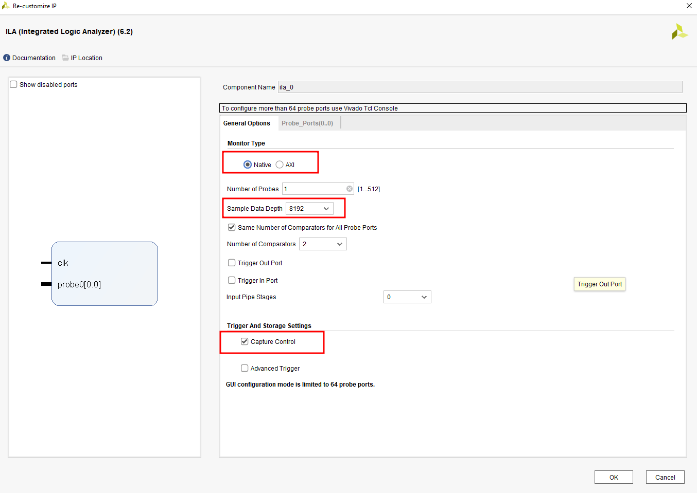
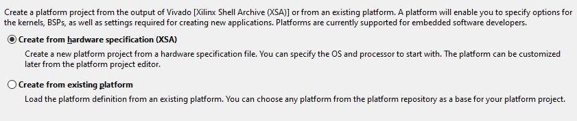

# Praca inżynierska 2.0

Implementacja mikrokontrolera PIC16F72 w układzie programowalnym z rodziny Zynq&trade; 7000 firmy Xilinx.
Całość projektu została zaimplementowana w języku VHDL.

## Sprzęt i oprogramowanie

Projekt został pomyślnie uruchomiony w następującej konfiguracji:

- Płyta MYIR MYS-7Z007S-C-S z układem Xilinx XC7Z007S-1CLG400C [link](https://kamami.pl/komputery-sbc/569426-myir-mys-7z007s-c-s-z-ukladem-xilinx-xc7z007s-1clg400c.html) [producent](https://www.myirtech.com/list.asp?id=565)
- Środowiska Xilinx Vivado 2019.2 oraz Xilinx Vitis IDE 2019.2 [link](https://www.xilinx.com/support/download.html)

Oprócz tego, do uruchomienia projektu niezbędne są:

- Ładowarka sieciowa 5.0V, 2.0A, wtyk 5,5mm x 2,1mm
- Programator i debugger USB do urządzeń Xilinx [link](https://botland.com.pl/programatory/16398-programator-i-debugger-usb-do-urzadzen-xilinx-waveshare-6530-5904422344450.html)
- Przewód JTAG 14-pin, raster 2,54 mm
- Przewód USB A - B 2.0

## Konfiguracja sprzętu

Przed uruchomieniem projektu, należy pamiętać o właściwej konfiguracji i sposobie podłączenia sprzętu.

1. Upewnij się, że piny `BOOT_JP1` są zwarte oraz piny `BOOT_JP2` nie są zwarte  - innymi słowy, wybrany jest tryb uruchomienia przez JTAG.
2. Przewód JTAG podłącz tak, by fioletowa krawędź przewodu była po tej samej stronie, co biały trójkąt na płycie. Drugą końcówkę przewodu podłącz do programatora.
3. Programator podłącz do komputera klasy PC przez kabel USB.
4. Płytę uruchomieniową podłącz do zasilania sieciowego.

Całość powinna wyglądać jak przedstawiono poniżej.

## Tworzenie projektu

W środowisku Xilinx Vivado należy utworzyć nowy projekt, a następnie umieścić w nim źródła modułów z niniejszego repozytorium. Opcjonalnie można zedytować źródło `program_memory.vhd` umieszczając w pamięci programu własny kod maszynowy dla odtwrzanej platformy. Następnie należy wybrać zakładkę *Create block design*, w celu utworzenia schematu blokowego. Należy na niego nanieść moduł `PICuC.vhd` (wystarczy przeciągnięcie pliku z zakładki *Sources* do schematu blokowego) oraz moduły IP: **ZYNQ7 Processing System** i **ILA (Integrated Logic Analyzer)**. Moduły IP należy przed połączeniem lekko skonfigurować:

- Po dodaniu **ZYNQ7 Processing System** należy kliknąć w zieloną zakładkę *Run block automation*, a następnie *OK*. Oprócz tego, dla dwukrotnym kliknięciu na moduł, należy ustawić wybraną częstotliwość zegara (maksymalnie 64 Mhz) oraz zaznaczyć wyprowadzenia UART.

- W ustawieniach **ILA** należy *monitor type* ustawić na *Native*, głębokość **ILA** ustawić na 8192 próbki, oraz zaznaczyć opcję *Capture Control*. Ponadto, wejścia ILA należy dodać i skonfigurować w takiej liczności i szerokości, w jakiej znajdują się wyjścia modułu `PICuC.vhd`.

Po konfiguracji, schemat blokowy powinien prezentować się w następujący sposób:

W zakładce *Sources* należy wtedy kliknąć prawym przyciskiem myszy na nazwie bieżącego schematu blokowego, i wybrać opcję *Generate HDL Wrapper*. Gdy operacja się zakończy, należy wybrać z tego samego menu opcję *Generate Output Products*.

Po wykonaniu tych czynności, można przystąpić do generacji pliku *bitstream*.

Może to potrwać przez dłuższy czas; Po udanej generacji powinien pojawić się następujący komunikat: 

Po kliknięciu *Cancel*, należy z menu *File* wybrać opcję *Export*, następnie *Export Hardware*. Należy **koniecznie** zaznaczyć opcję *Include bitstream* i kliknąć przycisk *Ok*.

Spowoduje to wygenerowanie w katalogu projektu Vivado pliku specyfikacji sprzętu z rozszerzeniem *xsa*, który potrzebny jest w kolejnym kroku.

W środowisku Vitis, które otworzyć można poprzez opcję menu *Tools* -> *Launch Vitis*, należy utworzyć nowy projekt platformy (*File* -> *New* -> *Platform Project*). Przy tworzeniu nowego projektu, należy podać jego nazwę, wybrać opcję *Create from hardware specification (XSA)*, a następnie wybrać wygenerowany wcześniej plik *xsa*. Resztę opcji należy pozostawić bez zmian.

Następnie, należy kliknąć w oknie projektu na *Modify BSP settings* i w zakładce *standalone* ustawić wartość *ps7_uart_1* dla pozycji *stdin* i *stdout* i zatwierdzić przez *Ok*.

Wygenerowany projekt należy zbudować, klikając na nim prawym przyciskiem myszy i wybierając opcję *Build project*.

Po zbudowaniu projektu platformy, należy utworzyć nowy projekt aplikacji; w tym celu należy wybrać w menu opcję *File* -> *New* -> *Application project*. Przy jego tworzeniu, należy podać jego nazwę, wybrać utworzony wcześniej projekt platformy, a resztę ustawień pozostawić bez zmian.

Po utworzeniu projektu, należy go zbudować, poprzez kliknięcie na nim prawym przyciskiem myszy i kliknięcie *Build Project*.

W środowisku Vivado, po kliknięciu na *Open hardware manager*, należy upewnić się, że płyta podłączona do komputera jest widoczna. W tym celu należy wybrać *Open target* -> *Autoconnect*.

Poprawne podłączenie płyty widoczne jest poniżej:

Teraz wystarczy w środowisku Vitis kliknąć na projekcie aplikacji prawym przyciskiem myszy i wybrać opcję *Debug as* -> *Launch on hardware*.

Nastąpi wgranie projektu na płytę. Po jego zakończeniu, w środowisku Vivado trzeba jeszcze kliknąć na opcję *Refresh device*.

Po odświeżeniu, płytka powinna być widoczna jako zaprogramowana.

Powinno pojawić się także okienko modułu ILA, w którym możliwe jest zobaczenie przebiegów sygnałów (opcja *Run trigger*, niebieski trójkąt).

Gotowe, projekt został wgrany na płytę.